# Pragmatic Audio PEQ

**A system-wide parametric EQ for your headphones.** Load a correction for your headphones (OPRA, AutoEq and the measurement
sites), edit it, make your own, and hear it on everything you play. Made by [Pragmatic Audio](https://www.pragmaticaudio.com/).

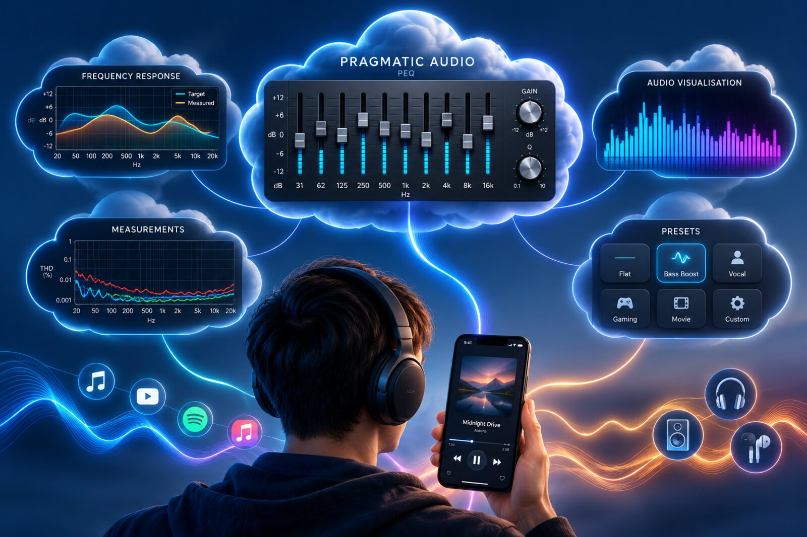

This repository holds the **downloads** (see [Releases](../../releases)). The source is not published here. The full write-up,
with every screen explained, is on the website:
**[Pragmatic Audio PEQ: the article](https://www.pragmaticaudio.com/articles/2026/10/pragmatic-audio-peq/)**.

## Downloads

| Platform | Get it | Status |
|---|---|---|
| **macOS** (Apple silicon and Intel, macOS 14 or newer) | the `.dmg` in the latest [`macos-v*` release](../../releases) | Signed and notarised by Apple. |
| **Windows 11** | the `Setup.exe` in the latest [`windows-v*` release](../../releases) | Early release. **Not code-signed yet**, so Windows shows a warning (see below). |
| **Android** (9 or newer) | the `.apk` in the latest [`android-v*` release](../../releases) | Early release. Installed by hand, outside Google Play (see below). |
| **iPhone and iPad** (iOS 27) | TestFlight, then the App Store | Needs iOS 27 and a real device. |

The Mac app checks this page once a day and tells you when a newer version is out.

### Installing on macOS

1. Open the `.dmg` and drag **Pragmatic Audio PEQ** to Applications.
2. The first time you open it, it offers to install its audio driver, a virtual output called **Pragmatic EQ**. macOS asks for an
   administrator password, and your sound pauses for a second while the audio service restarts. Nothing is recorded.
3. Choose **Pragmatic EQ** as your sound output (the app can do that for you), and what you play is equalised.

The app lives in the menu bar and can open at login. **Uninstall Audio Driver…** in its menu removes the driver; then drag the
app to the Trash.

### Installing on Windows 11

1. Download `PragmaticAudioPEQ-…-Setup.exe` and run it. It needs administrator rights: it installs the app and an audio
   processing object that Windows' audio engine loads.
2. **Windows will warn you** ("Windows protected your PC"), because the installer is not yet signed with a paid code-signing
   certificate. Choose **More info**, then **Run anyway**. You can compare the file with the one on this page if you want to be sure.
3. In the app, open **Settings > Windows audio** and turn it on for your headphones. A tray icon keeps it running with the
   window closed.

Limits for now: stereo outputs only, and a few audio drivers replace Windows' effects and may drop ours (the app tells you and
offers to turn it back on). The uninstaller removes everything it added.

### Installing on Android

Android apps outside Google Play are installed by hand, which means allowing **unknown sources** once:

1. Download the `.apk` on the phone (or copy it there).
2. Open it. Android asks to allow installs from that app (your browser or file manager): choose **Settings**, switch on
   **Allow from this source**, and go back.
3. Choose **Install**. Later updates are installed the same way, over the top, and keep your settings.

Android has no system-wide output to choose, so the EQ is attached to the audio of the players that announce themselves, which
is how Wavelet and Poweramp Equalizer work. That means:

- Most music players work. A few, and some phones' own sound effects (Samsung's, Dolby's), can get in the way.
- The live spectrum needs the **microphone permission** (Android uses it for audio visualisers; nothing is recorded), and Android only
  gives it coarse, mono, 8-bit audio, so those views are rougher than on a Mac or iPhone.
- It needs Android 9 or newer.

## What it does

- **System-wide parametric EQ**, under any music app.
- **Load a PEQ** from [OPRA](https://opra.roonlabs.net/) (thousands of headphones and IEMs, every creator credited), from the
  measurement sites through their Export button, or from a `Filters.txt` file.
- **One PEQ editor**: drag the dots, change the width, type exact values, and hear every change live.
- **Make your own**: simple bass and treble, a fixed-band graphic EQ, an advanced editor, and **Uplifting PEQ**, a listening
  process that tunes the treble above 4 kHz to your own ears.
- **A bass and treble preference** that sits on top of any PEQ and any headphone.
- **A personalised library** you can export and import, and **pin to your headphones**, so they load their own PEQ when they
  connect.
- **A/B testing**, with volume matching, and a **blind test** with an exact result.
- **Effects**: crossfeed, a tube amp and vinyl.
- **Live visualisation**: eight views, including Visual PEQ, which shows what the EQ does to your music as it plays.
- **Headroom management**: the preamp is set from the filters, **Smart headroom** gives back volume where it safely can, and a
  limiter guards the peaks.
- **In English, French, Spanish, German, Italian, Chinese and Japanese.**

## A look

| | |
|---|---|
| 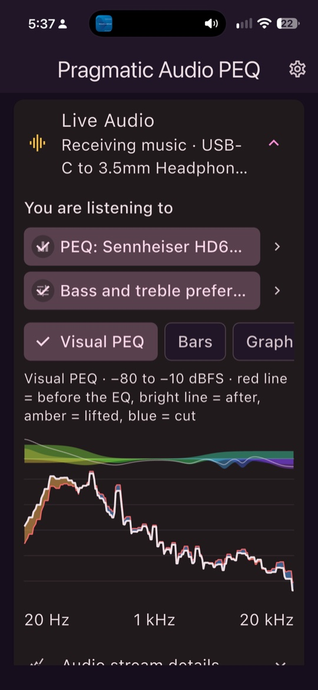 | 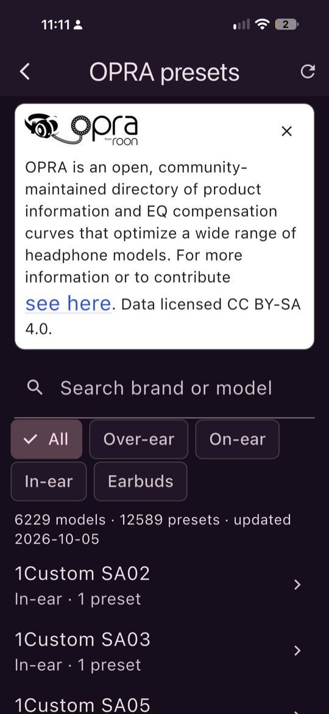 |
| **Live Audio**: what you are hearing, and what the EQ is doing to it. | **Load**: OPRA's headphones and presets, with the creator credited. |
| 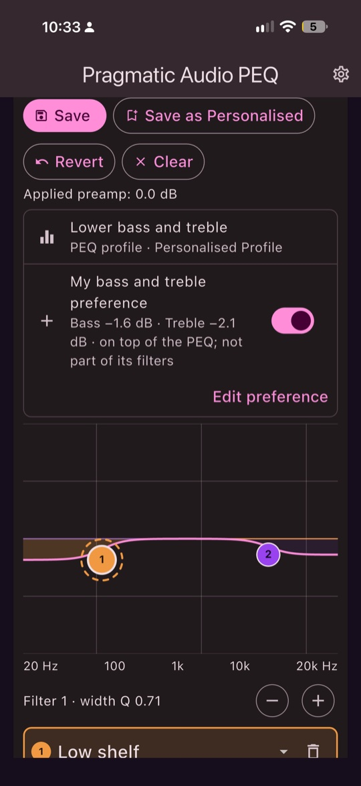 | 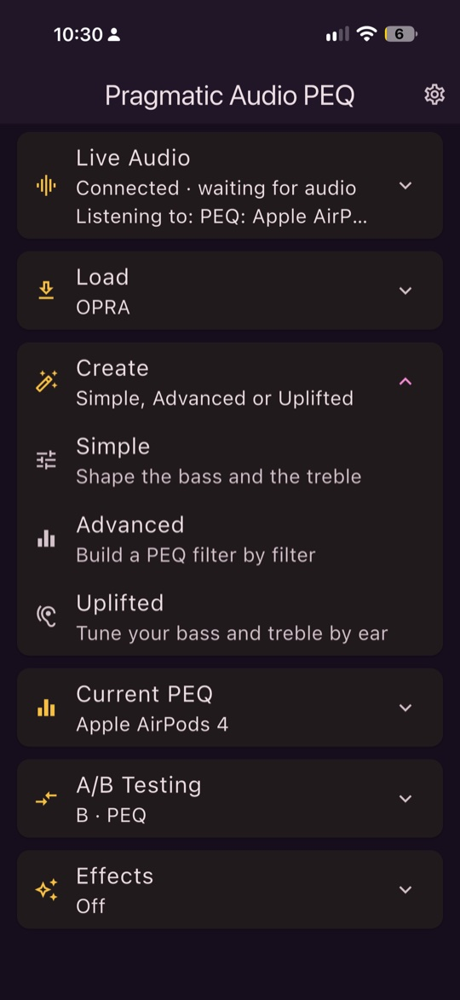 |
| **The editor**: one editor for every profile. | **Create**: Simple, Advanced or Uplifted. |
| 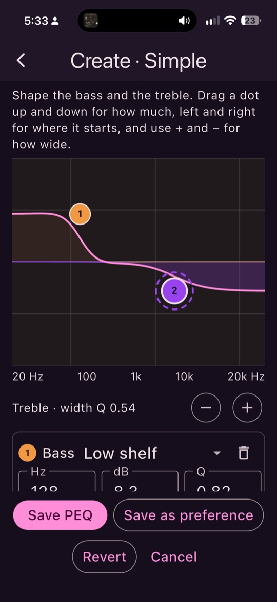 | 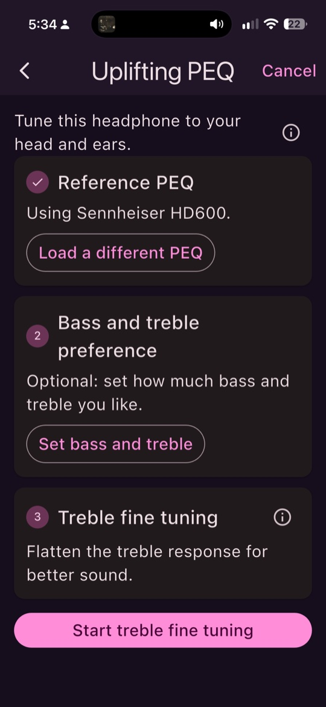 |
| **Simple**: bass and treble, heard as you move them. | **Uplifting PEQ**: tune the treble to your own ears. |
|  | 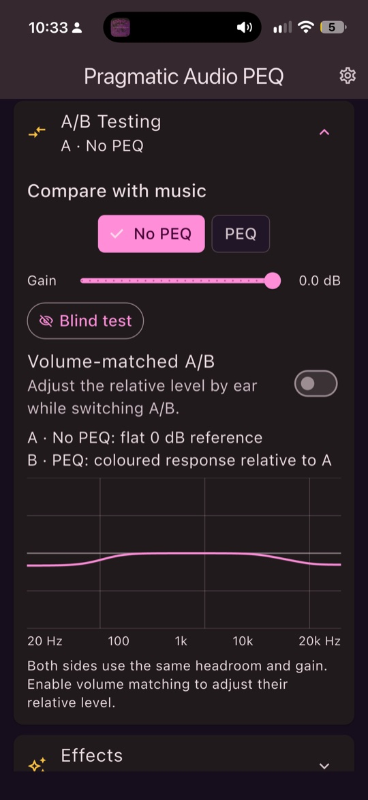 |
| **Library**: keep profiles, and pin one to your headphones. | **A/B testing**: with and without, level-matched. |
| 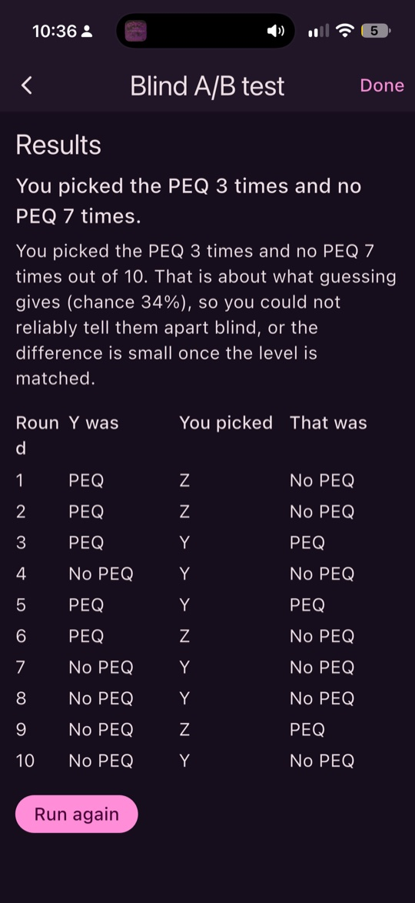 | 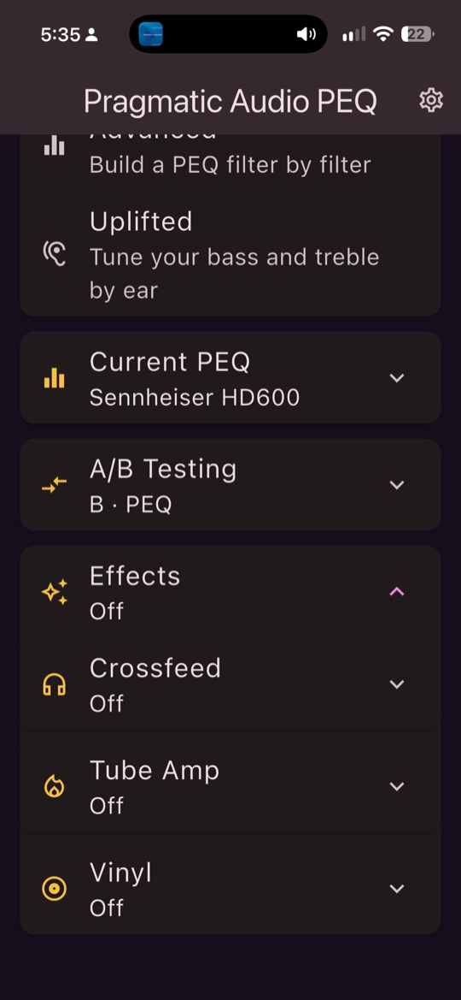 |
| **Blind test**: does the PEQ really sound different? | **Effects**: crossfeed, tube amp and vinyl. |
| 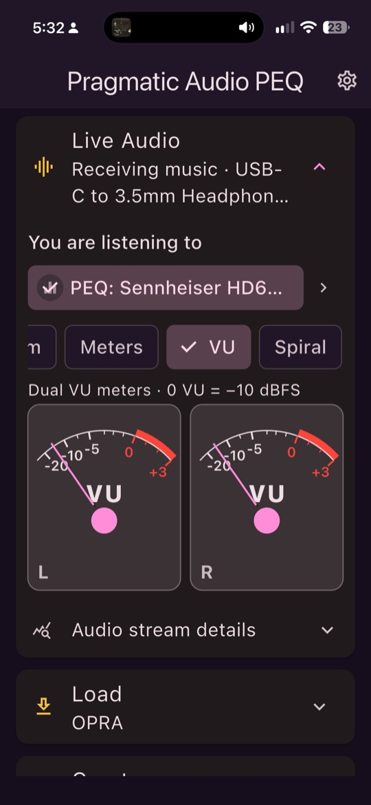 | 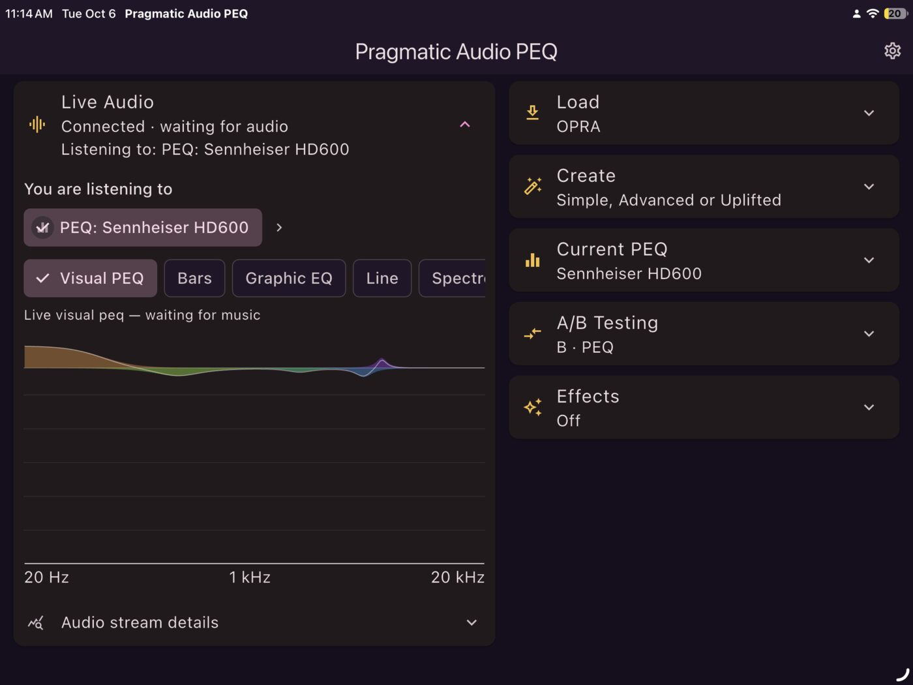 |
| **Views**: VU meters, spectrum, spiral and more. | **iPad and big windows** get two panes. |

The screenshots are from the iPhone and iPad. The Mac, Windows and Android apps are the same app and look the same, with
the parts that need the platform's own audio (the output, the driver, the effect) adapted.

## Good to know

- It does not record, store or send your audio. OPRA's preset list is downloaded (about 1 MB) when you open Load.
- Uplifting PEQ is a listening aid, not a measurement. Check it with the blind test.
- Smart headroom trusts the limiter for the occasional peak. If your music is unusually bright and loud, use Safe.
- Vinyl and Tube Amp are effects inspired by real things, not models of specific equipment.

## Support

If it is useful to you, you can [buy Pragmatic Audio a coffee](https://buymeacoffee.com/pragmaticaudio). Bug reports and
suggestions are welcome as [Issues](../../issues) in this repository.

## Credits

Headphone corrections come from [OPRA](https://opra.roonlabs.net/) and its contributors (including oratory1990 and AutoEq),
credited in the app next to every preset. Pragmatic Audio PEQ is not affiliated with any of them.
